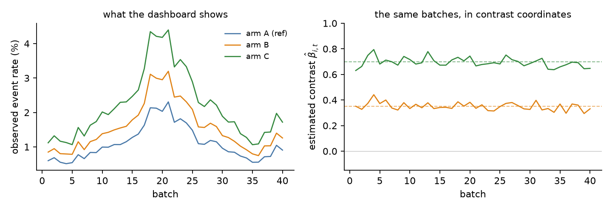
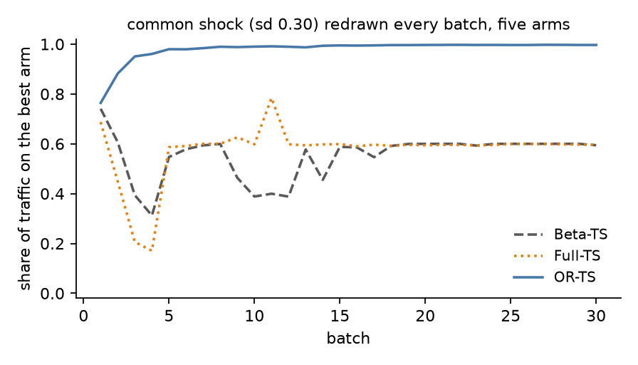

# OR-TS — 오즈비 톰슨 샘플링 (Odds-Ratio Thompson Sampling)

[](README.md)
[](README.ko.md)

[](https://github.com/sulgik/orts/actions/workflows/tests.yml)
[](https://arxiv.org/abs/2609.19709)
[](https://pypi.org/project/orts/)
[](https://www.python.org/downloads/)
[](https://colab.research.google.com/github/sulgik/orts/blob/main/notebooks/orts_quickstart.ipynb)
[](https://opensource.org/licenses/MIT)

**오즈비 톰슨 샘플링(Odds-Ratio Thompson Sampling)** 의 참조 구현입니다.
이진 결과를 갖는 배치 A/B 테스트와 멀티암드 밴딧을 위한 톰슨 샘플링
정책으로, 각 arm의 절대 이벤트율이 아니라 **처치 대비(contrast)의 결합
사후분포**(로그 오즈비)를 기억으로 삼습니다.

> S. Kim (2026). *Odds-Ratio Thompson Sampling: A Specification and Design
> Guide for Contrast-Based Multi-Armed Bandits.* [arXiv:2609.19709](https://arxiv.org/abs/2609.19709).
> S. Kim and K. Kim (2020). *Odds-ratio Thompson sampling to control for
> time-varying effect.* [arXiv:2003.01905](https://arxiv.org/abs/2003.01905).

## 한 문단으로 보는 아이디어

플랫폼의 이벤트율은 함께 움직입니다. 프로모션, 레이아웃 변경, 연휴는
모든 arm을 한꺼번에 이동시킵니다. arm별 Beta-Bernoulli 상태는 각 arm의
절대 이벤트율을 기억하므로, 그런 이동이 있을 때마다 전부를 다시 잊어야
합니다. OR-TS는 배치마다 한 번, 그 배치의 카운트에 평범한 기준 코딩
(reference-coded) 로지스틱 회귀를 적합합니다. 배치의 공통 수준(level)에는
매번 새로운 평탄 사전분포 절편을 두고, 이월된 대비의 사후분포를
사전분포로 씁니다. 그런 다음 대비만 남기고 수준은 버립니다. 한 배치
안에서는 두 기술 방식이 좌표만 다른 같은 것이지만, 배치를 넘어서는
무엇이 고정되어 있다고 베팅하는지가 다릅니다. 실제 A/B 테스트 시계열
86개에서 수준은 대비보다 약 25배 더 크게 움직였고, 그 모든 시계열에서
수준이 더 많이 움직였습니다.



*왼쪽: 세 arm의 관측 이벤트율은 공통 수준이 모든 곡선을 지배하기 때문에
거의 평행하게 움직입니다. 오른쪽: 같은 배치들을 대비 좌표로 본
모습입니다. OR-TS가 기억하는 것은 이것입니다.*

```
Beta-TS :  p_{i,t} = p_{i,t-1}                        모든 arm의 이벤트율이 고정
Full-TS :  (alpha_t, beta_t) = (alpha_{t-1}, beta_{t-1})   같은 베팅, 로지스틱 좌표
OR-TS   :  beta_t = beta_{t-1},  alpha_t ~ flat         대비만 고정
```



*arm 5개, 배치마다 새로 뽑는 표준편차 0.30의 공통 충격, 5회 실행의 평균
(`examples/make_readme_figures.py`). 수준을 기억하는 정책들은 계속 그것을
쫓아가지만, OR-TS는 애초에 수준을 이월하지 않습니다.*

## 10분 만에 써 보기

[`notebooks/orts_quickstart.ipynb`](https://colab.research.google.com/github/sulgik/orts/blob/main/notebooks/orts_quickstart.ipynb)
는 설정 없이 Colab에서 바로 실행됩니다. 두 좌표계, 한 번의 업데이트
사이클, 플랫폼 이동, 세 정책의 비교, 직접 가진 카운트에 대한 진단, 기본
중단 규칙을 다룹니다.

## 설치

```bash
pip install orts            # 의존성은 numpy와 scipy뿐입니다
pip install -e ".[dev]"     # 클론한 저장소에서, pytest 포함
```

## 빠른 시작: 알고리즘 1

```python
import numpy as np
from orts import LogisticBandit

bandit = LogisticBandit()                        # 알고리즘 1의 대칭 사전분포, tau = sqrt(2)

# 경계 t: 플랫폼이 배치의 카운트 {arm: [노출 수, 이벤트 수]} 를 넘겨줍니다
bandit.update({"A": [30000, 300], "B": [30000, 330], "C": [30000, 290]})
#   R1  새로운 평탄 절편으로 기준 코딩 로지스틱 모형을 적합
#   R2  대비의 주변 가우시안 (mu, S) 만 남기고 절편은 버림

q = bandit.allocate(["A", "B", "C"], draw=100_000, rng=np.random.default_rng(0))
#   A1  대비 벡터를 뽑고, 기준 arm을 0으로 두어 각 draw의 승자를 찾음
#   A2  승자 비율이 다음 배치의 할당
q.shares          # {'A': 0.11, 'B': 0.85, 'C': 0.04}   다음 할당
q.p_best          # 각 arm이 최적일 사후 확률
q.expected_loss   # 지금 각 arm으로 확정할 때의 기대 손실 (로그 오즈 단위)
q.leader          # 'B'
```

행동(action)은 **`allocate`** 입니다. 다음 배치에서 운영될 arm들을 순서와
무관하게 지정하면 그 할당을 돌려줍니다. A1은 상태에 질의하는 톰슨
draw이고, A2는 승자 빈도를 할당 비율로 바꿉니다. arm 집합이 상태의 것과
일치할 필요는 없습니다. 빠진 arm은 할당받지 않지만 기억에는 남고, 상태가
한 번도 본 적 없는 arm은 아직 사후분포가 없으므로 균등 비율을 받습니다.
`win_prop(arms)` 는 비율만 반환합니다.

경계마다 `update` 후 `allocate` 를 반복합니다. 상태는 `bandit.action_list`
위의 쌍 `(bandit.mu, bandit.sigma_inv)` 이며, 하나의 정준 순서로
유지됩니다. arm은 처음 관측된 순서대로, 기준 arm은 마지막에 옵니다(기준
arm은 첫 배치의 첫 arm이거나 `LogisticBandit(reference="control")` 로
지정). 성분은 기준 arm에 대한 각 arm의 대비들이고, 그 뒤에 수준이 오는데
수준은 다음 업데이트에서 교체됩니다. 배치와 질의는 arm을 임의의 순서나
부분집합으로 지정할 수 있습니다. `contrasts()` 는 상태를
`{arm: (mean, sd)}` 로 읽어 주고, `set_reference` 와 `drop` 은 아무것도
잃지 않고 상태의 기준을 바꾸거나 상태를 접습니다.

## 논문의 용어와 코드에서의 위치

| 논문 | 코드 |
|---|---|
| 알고리즘 1, R1–R2 (적합, 주변화) | `LogisticBandit.update(obs)` |
| 알고리즘 1, A1 (draw) / A2 (할당) | `allocate(arms)`, `Allocation` 을 반환; A1만 필요하면 `contrast_draws()`, 비율만 필요하면 `win_prop()` |
| Full-TS, Beta-TS와 같은 기억을 가진 대조군 | `update(obs, odds_ratios_only=False)` |
| Beta-TS, arm별 베이스라인 | `TSPar` |
| 할인 Beta-TS, 같은 망각을 갖는 베이스라인 | `DiscountedTSPar(discount)` |
| 대칭 고유(proper) 대비 사전분포, 기본값 (알고리즘 1, 부록 A) | `LogisticBandit()`, τ를 바꾸려면 `arm_effect_prior_sd=tau` |
| 과거의 평탄 옵션 (부록 A) | `LogisticBandit(contrast_prior="flat")` |
| 감쇠 λ (5.1절) | `update(obs, decay=λ)` |
| 공격성 γ (5.2절) 과 하한 (부록 G) | `allocate(arms, aggressive=γ, floor=f)` |
| 변하는 arm 집합 (6.1절), 변환 (부록 B) | `allocate(arms)` 에 임의의 arm 집합; `set_reference()`, `drop()`, `get_par()` |
| 새 arm의 대칭 증강 (부록 B) | `update` 에서 자동; 새 arm이 결합 상태에 합류 |
| 독립적인 실험 그룹 (부록 B) | `update` 에서 자동; `groups()` 로 조회하며, 두 그룹을 잇는 배치는 예외 발생 |
| 다리: 공유 arm이 간접 비교를 전달 (6.1절, 부록 B) | 자동; 새 arm이 증강을 통해 그룹에 합류 |
| 새 arm 트래픽 규칙, 각각 `1/\|A\|` (6.1절, 부록 B) | `allocate` 가 사후분포가 없는 arm과, 걸쳐 있는 각 그룹에 부여 |
| Beta-Bernoulli 서비스로부터의 웜 스타트 (부록 D, 대수는 G) | `LogisticBandit.from_beta_posteriors({arm: (a, b)})` |
| 건너뛰는 배치: 이벤트가 없거나 비이벤트가 없음 (알고리즘 1, 부록 A) | `update` 가 `False` 를 반환하고 상태를 그대로 둠 |
| 시작 시 할당 (알고리즘 1) | 적합 이전에는 `allocate` 가 균등 할당을 반환 |
| 중단 및 arm 제거에 쓰는 양 (부록 G) | `allocate(arms).p_best` 와 `.expected_loss` |
| λ를 전이 모형과 연결 (부록 G) | `implied_decay(excess_sd_beta)` |
| 가정에 대한 진단 (4.2절, 부록 E) | `orts.diagnostics` |

## 대비 사전분포, 그리고 0 카운트와 완전 카운트

기본값은 논문의 대칭 고유 사전분포입니다. arm 효과에 교환 가능한
`N(0, tau^2)` 를 두므로 모든 쌍별 차이의 사전 분산은 `2 tau^2` 이고 모든
arm의 사전 승자 확률은 `1/K` 이며, 그 어느 것도 어떤 arm이 기준인지에
의존하지 않습니다. 알고리즘 1의 `tau` 는 `sqrt(2)` 이므로 모든 쌍별 로그
오즈 대비의 사전 표준편차는 `2` 입니다.
`LogisticBandit(arm_effect_prior_sd=tau)` 로 바꿀 수 있습니다. 그 대가는
미리 정해 둔 그 척도입니다. 기존 arm들의 평균 쪽으로의 수축은 정말로
극단적인 차이의 학습을 늦출 수 있고, 실행 도중에 들어온 arm에서 가장
그렇습니다. 나중에 합류하는 arm은 부록 B의 증강으로서 같은 모집단을 통해
들어오며, 이는 기존 arm들의 쌍별 사후분포를 건드리지 않습니다.

평탄 절편 사전분포 아래에서는 이벤트가 전혀 없거나 비이벤트가 전혀 없는
배치의 사후분포가 비고유(improper)합니다. `update` 는 그런 배치를
건너뛰고 `False` 를 반환하며 상태를 그대로 둡니다. 건너뛴 배치의 카운트를
마치 같은 절편을 공유하는 것처럼 다음 배치에 합치지 마십시오. 개별 arm이
0 카운트나 완전 카운트에 있는 것만으로는 그런 일이 일어나지 않습니다.
바로 이것을 허용하기 위해 고유 사전분포가 기본값입니다.

`LogisticBandit(contrast_prior="flat")` 는 과거의 정밀도 0 옵션을
선택하며, 이전 실행들을 재현합니다. 이 옵션에서는 첫 적합 때 모든 arm에
이벤트와 비이벤트가 모두 있어야 하고, 나중에 합류하는 arm도 마찬가지
입니다. 여기서 분리된(separated) arm은 유한한 적합값이 아예 없으므로,
`update` 는 옵티마이저가 흘러가 닿았을 큰 유한값을 반환하는 대신 예외를
일으킵니다. 사전분포와 그 척도는 결과를 보기 전에 정하십시오. 논문은
분리가 나타난 뒤에 바꾸지 말라고 말합니다.

## 에이전트의 두 가지 조절 장치

논문은 5절을 두 단계를 반복하는 에이전트로 읽습니다. 인식(recognition)은
방금 닫힌 배치로부터 믿음을 갱신하고, 행동(action)은 그 믿음을 다음
할당으로 바꿉니다. 각 단계에 조절 장치가 하나씩 있습니다.

**감쇠(decay)** 는 인식 쪽의 조절 장치로, 이월되는 것에 작용합니다.
`update(obs, decay=0.1)` 은 적합 전에 이월된 대비 정밀도에 `1 - 0.1` 을
곱합니다. 유효 기억은 대략 `1/decay` 배치이며, `DiscountedTSPar` 에서 같은
숫자는 같은 기억을 뜻합니다. Beta 밀도를 템퍼링하는 것이 곧 카운트
할인이기 때문입니다. 논문의 사전 등록된 시뮬레이션이 언제 이득인지
말해 줍니다. arm 집합이 고정되어 있고 대비가 제자리에 있는 곳에서는
`decay=0` 이 데이터가 지지하는 설정이고 그래도 감쇠를 쓰면 후회(regret)를
치릅니다. arm이 상대적 매력이 표류하는 인벤토리인 곳에서는 감쇠가 뒤처짐과
앞섬을 가릅니다.

**공격성(aggressiveness)** 은 믿음이 트래픽을 얼마나 강하게 움직이는지에
작용합니다. 행동 쪽의 조절 장치입니다. `allocate(arms, aggressive=2.0)` 은
승자 비율을 거듭제곱한 뒤 다시 정규화합니다. `floor=0.05` 는 그 뒤에 모든
arm에 일정 비율을 보장하며, 승자 빈도 0은 거듭제곱 사상 아래에서 0으로
남기 때문에 이것이 비율을 보장하는 유일한 방법입니다. 둘 다 사후분포는
건드리지 않습니다. `aggressive=0` 은 사후분포는 계속 갱신되는 균형 A/B
할당이므로, 증거가 쌓임에 따라 γ를 0에서부터 올려 갈 수 있습니다. 논문은
그 스케줄에 이름을 붙이고 비용을 매기지만, 실험에서는 γ=1을 유지하며 어떤
스케줄도 검증하지 않습니다.

## 진단: 가정이 성립하고 있는가?

상태 분리 가정은, 한 배치 안에서는 arm들이 하나의 수준을 공유하고 배치를
넘어서는 대비가 지속된다는 것입니다. `orts.diagnostics` 는 기록된
카운트만으로 논문 4.2절이 측정하는 것을 계산합니다.

```python
from orts import diagnostics as dg

(alpha, var_alpha), contrasts = dg.batch_contrasts(obs_t, reference="A")   # 배치 하나
# 배치들에 걸쳐 alpha_t, var_alpha_t, contrasts["B"] 를 모은 뒤
R = dg.level_contrast_ratio(alphas, alpha_vars, betas, beta_vars)  # >>1: 수준은 움직이고 대비는 움직이지 않음
w = dg.excess_sd(betas, beta_vars)                                # 잡음을 넘어서는 대비의 움직임
lam = bandit.implied_decay(w)                                     # 그 움직임이 함의하는 감쇠
```

각 배치의 대비를 `dg.sampling_band(beta_vars)` 와 함께 그려 보십시오.
눈에 띄는 기억을 가지고 밴드 밖으로 벗어나는 점들은 대비가 표류하고
있다는 뜻입니다. `dg.lag1_autocorrelation` 은 표류(양수)와 잡음을 통해
보이는 상수(0 근처)를 구분합니다. 초과 표준편차는 관측 기간 전체에 걸친
산포이지 연속한 기간 사이의 한 걸음 크기가 아니므로, `implied_decay` 는
할인율의 추정치가 아니라 사전에 지정할 할인율의 출발점입니다. 부록 G가
이를 명시합니다.

배치 크기에 대해 논문은 이벤트 수 임계값을 제시하지 않고, 대신 측정한
근사 오차를 가리킵니다. 배치당 이벤트가 수백 개면 가우시안 상태의 비용은
승자 확률로 수백분의 1 퍼센트포인트, 수십 개면 최대 약 2 퍼센트포인트,
몇 개뿐이면 여러 퍼센트포인트입니다. 그것이 문제가 되는 곳에서 조정할
것은 방법이 아니라 사이클 길이입니다.

## 중단과 arm 제거

`allocate` 한 번이 기본 규칙에 필요한 것을 계산합니다. `q.p_best` 는 각
arm이 최적일 사후 확률이고, `q.expected_loss` 는 지금 그 arm으로 확정할
때의 기대 손실(로그 오즈 단위)이며, 둘 다 할당 비율과 같은 draw에서
나옵니다. 쓸 만한 기본 규칙은 이렇습니다. 확률이 여러 배치 연속으로 1%
미만인 arm은 제거하고, 선두의 확률이 95%를 넘고 그 기대 손실이 비즈니스가
포기할 수 있는 수준보다 낮으면 중단합니다. 절대 이벤트율 사후분포에 대한
임계값은 수준이 움직이면 함께 움직이지만, 대비 사후분포에 대한 임계값은
그렇지 않습니다. `examples/ab_testing.py` 를 참고하고, 매 배치마다
확인하는 것은 순차 검정이라는 점을 기억하십시오.

## 운영 중인 Beta-Bernoulli 서비스에서 옮겨 오기

들어가는 카운터도 같고 나오는 확률 매칭 인터페이스도 같으며, 세 가지가
달라집니다. 카운트는 누적이 아니라 사이클별이어야 합니다. 상태는 총계에서
다시 계산할 수 있는 캐시가 아니라 배치 이력에 대한 폴드(fold)이므로,
마지막으로 흡수한 배치의 id와 함께 저장하십시오. 그리고 기존 서비스의
Beta 사후분포로 대비 사전분포를 초기화할 수 있습니다.
`LogisticBandit.from_beta_posteriors({arm: (a, b)})` 는 그 대비에 대한
믿음을 물려받고 첫 업데이트에서 수준에 대한 믿음은 버리는데, 그것이 바로
요점입니다.

## 컨텍스트: 셀 전체에 대한 하나의 모형 (실험적)

`ContextualLogisticBandit` 은 기억 규칙을 이산 컨텍스트(세그먼트, 트리의
리프, 교차된 속성 수준)로 확장합니다. 논문에는 없는 내용입니다. 각 배치는
하나의 로지스틱 적합 `logit p = alpha[cell] + theta[arm, cell]` 이며,
셀과 배치마다 새로운 평탄 절편을 두고 모든 arm-셀 대비의 이월된 결합
사후분포를 사전분포로 씁니다. 셀의 기저 이벤트율과 그 셀의 arm들을 함께
이동시키는 것은 이전과 마찬가지로 버려집니다.

```python
from orts import ContextualLogisticBandit

bandit = ContextualLogisticBandit(arms=["A", "B", "C"], cells=["mobile", "desktop"])
bandit.update({"mobile":  {"A": [9000, 270], "B": [9000, 300], "C": [9000, 280]},
               "desktop": {"A": [3000, 150], "B": [3000, 140], "C": [3000, 170]}})
shares = bandit.allocate(floor=0.01)       # {cell: Allocation}
```

셀들은 계층적 사전분포로 묶여 있으며, 그 유일한 모수 `interaction_sd` 는
한 셀의 대비가 모든 셀이 공유하는 대비에서 얼마나 멀리 있을 수 있는지를
정합니다. 0에 가까우면 비컨텍스트 OR-TS이고, 크면 셀마다 독립적인
OR-TS입니다. 기본적으로 매 배치 후 주변 가능도로 다시 추정되므로, 서로
일치하는 셀은 합쳐지고 일치하지 않는 셀은 분리됩니다. 셀이 하나일 때 이
클래스는 `LogisticBandit` 을 재현합니다.

`benchmarks/growthbook/ctxbench.py` 는 이것을 GrowthBook의 컨텍스추얼
밴딧 엔진과 나란히 실행합니다. 감쇠, 나중에 합류하는 arm이나 셀, 연속형
공변량은 아직 지원하지 않습니다.

## 예제와 테스트

```bash
python examples/basic_usage.py     # 알고리즘 1을 경계 하나씩
python examples/comparison.py      # 공통 충격 아래에서 OR-TS vs Beta-TS vs Full-TS
python examples/ab_testing.py      # 웜 스타트 후 기본 중단 규칙
python examples/make_readme_figures.py   # README의 그림 두 개 (matplotlib 필요)
pytest -q
```

`tests/test_paper_features.py` 는 논문의 주장 중 코드로 표현되는 것들을
검사합니다. 수준 이동에 대한 순위 불변성, 기억 규칙, 고유성(properness)
건너뛰기, 감쇠와 그 Beta 쪽 대응물, 공격성과 하한, 기준 변환, 웜 스타트,
진단입니다.

## 구성

```
orts/                 패키지
  logisticbandit.py   LogisticBandit: OR-TS (기본값) 와 Full-TS
  contextual.py       ContextualLogisticBandit: arm-셀 대비에 대한 OR-TS (실험적)
  ts.py               TSPar, DiscountedTSPar
  diagnostics.py      배치 대비, 초과 분산, R, 함의된 감쇠
  utils.py            배치별 라플라스 적합
examples/             실행 가능한 스크립트 (README 그림 생성기 포함)
notebooks/            Colab 퀵스타트
docs/                 README 그림과 RESEARCH_PLAN.md (논문의 바탕이 된
                      사전 등록 기록, H1-H27)
tests/                pytest 스위트
archive/2020/         2020년 프리프린트의 합성 실험 러너와 그 출력
logisticbandit.py, ts.py, utils.py   폐기 예정(deprecated) import shim
```

2026년 논문([arXiv:2609.19709](https://arxiv.org/abs/2609.19709))의 사전
등록된 시뮬레이션, 데이터셋 분석, 원고는 별도의 연구 저장소에 있으며, 이
패키지는 그것들이 실행하는 구현입니다. 그 실행들이 따르는 사전 등록
기록은 각 가설의 예측과 실패 기준을 실행 전에 적어 둔 것으로, 여기에
`docs/RESEARCH_PLAN.md` 로 공개되어 있습니다. 논문의 부록은 실행 id 옆에
그 라벨 H1-H27을 인용합니다.

## 인용

```bibtex
@misc{kim2026orts,
  author        = {Kim, Sulgi},
  title         = {Odds-Ratio Thompson Sampling: A Specification and Design Guide
                   for Contrast-Based Multi-Armed Bandits},
  year          = {2026},
  eprint        = {2609.19709},
  archivePrefix = {arXiv},
  url           = {https://arxiv.org/abs/2609.19709}
}
@article{kim2020orts,
  author  = {Kim, Sulgi and Kim, K.},
  title   = {Odds-ratio Thompson sampling to control for time-varying effect},
  journal = {arXiv preprint arXiv:2003.01905},
  year    = {2020}
}
```

MIT 라이선스.
