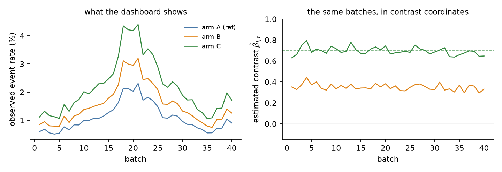
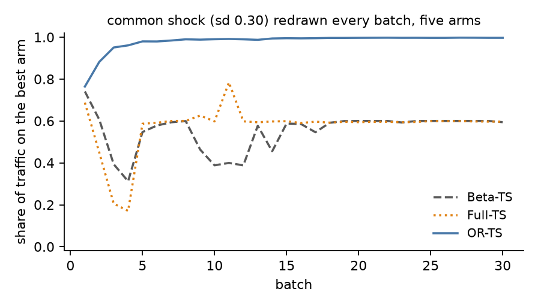

# OR-TS — Odds-Ratio Thompson Sampling

[](https://github.com/sulgik/orts/actions/workflows/tests.yml)
[](https://arxiv.org/abs/2609.19709)
[](https://pypi.org/project/orts/)
[](https://www.python.org/downloads/)
[](https://colab.research.google.com/github/sulgik/orts/blob/main/notebooks/orts_quickstart.ipynb)
[](https://opensource.org/licenses/MIT)

Reference implementation of **Odds-Ratio Thompson Sampling**, a Thompson
sampling policy for batched A/B tests and multi-armed bandits with binary
outcomes whose memory is the **joint posterior of the treatment contrasts**
(log odds ratios) rather than each arm's absolute event rate.

> S. Kim (2026). *Odds-Ratio Thompson Sampling: A Specification and Design
> Guide for Contrast-Based Multi-Armed Bandits.* [arXiv:2609.19709](https://arxiv.org/abs/2609.19709).
> S. Kim and K. Kim (2020). *Odds-ratio Thompson sampling to control for
> time-varying effect.* [arXiv:2003.01905](https://arxiv.org/abs/2003.01905).

## The idea in one paragraph

A platform's event rates move together: a promotion, a layout change, a
holiday shifts every arm at once. A per-arm Beta-Bernoulli state remembers
each arm's absolute rate and must unlearn all of them after every such
shift. OR-TS fits, once per batch, an ordinary reference-coded logistic
regression on the batch's counts, with a fresh flat-prior intercept for the
batch's common level and the carried posterior of the contrasts as the
prior. It then keeps only the contrasts and discards the level. Within a
batch the two descriptions are the same thing in different coordinates;
across batches they bet on different things staying fixed. On 86 real A/B
test series the level moved about twenty-five times as much as the
contrast, and in every one of them it moved more.



*Left: three arms' observed event rates move almost in parallel because a
common level dominates every curve. Right: the same batches in contrast
coordinates. That is what OR-TS remembers.*

```
Beta-TS :  p_{i,t} = p_{i,t-1}                        every arm's rate is fixed
Full-TS :  (alpha_t, beta_t) = (alpha_{t-1}, beta_{t-1})   same bet, logistic coordinates
OR-TS   :  beta_t = beta_{t-1},  alpha_t ~ flat         only the contrasts are fixed
```



*Five arms, a common shock of sd 0.30 redrawn every batch, mean of five
runs (`examples/make_readme_figures.py`). The policies that remember the
level keep chasing it; OR-TS never carried it.*

## Try it in ten minutes

[`notebooks/orts_quickstart.ipynb`](https://colab.research.google.com/github/sulgik/orts/blob/main/notebooks/orts_quickstart.ipynb)
runs in Colab with no setup: the two coordinate systems, one update cycle, a
platform shift, the three-policy comparison, the diagnostics on your own
counts, and a default stopping rule.

## Install

```bash
pip install orts            # numpy and scipy are the only dependencies
pip install -e ".[dev]"     # from a clone, with pytest
```

## Quick start: Algorithm 1

```python
import numpy as np
from orts import LogisticBandit

bandit = LogisticBandit()                        # Algorithm 1's symmetric prior, tau = sqrt(2)

# boundary t: the platform hands over the batch's counts {arm: [exposures, events]}
bandit.update({"A": [30000, 300], "B": [30000, 330], "C": [30000, 290]})
#   R1  fit the reference-coded logistic model with a fresh flat intercept
#   R2  keep the marginal Gaussian of the contrasts (mu, S); discard the intercept

q = bandit.allocate(["A", "B", "C"], draw=100_000, rng=np.random.default_rng(0))
#   A1  draw contrast vectors, score the reference arm 0, find each draw's winner
#   A2  winner shares are the next batch's allocation
q.shares          # {'A': 0.11, 'B': 0.85, 'C': 0.04}   the next allocation
q.p_best          # posterior probability that each arm is best
q.expected_loss   # expected loss of committing to each arm now, in log-odds
q.leader          # 'B'
```

The action is **`allocate`**: name the arms that will be live in the next
batch, in any order, and get their allocation. A1 queries the state — the
Thompson draw — and A2 turns the winner frequencies into the shares. The arm
set need not match the state's. Arms left out are not allocated but stay in
memory; an arm the state has never seen gets the uniform share, since it has
no posterior yet. `win_prop(arms)` returns just the shares.

Repeat `update` then `allocate` at every boundary. The state is the pair
`(bandit.mu, bandit.sigma_inv)` over `bandit.action_list`, kept in one
canonical order: arms in the order first seen, the reference arm last (the
first arm of the first batch, or `LogisticBandit(reference="control")`).
The entries are the contrasts of every arm against the reference, then the
level, which the next update replaces. Batches and queries may name arms in
any order or subset; `contrasts()` reads the state as `{arm: (mean, sd)}`;
`set_reference` and `drop` re-base or fold the state without losing
anything.

## What the paper calls it, and where it is in the code

| paper | code |
|---|---|
| Algorithm 1, R1–R2 (fit, marginalize) | `LogisticBandit.update(obs)` |
| Algorithm 1, A1 (draws) / A2 (allocation) | `allocate(arms)`, returning an `Allocation`; `contrast_draws()` for A1 alone, `win_prop()` for the shares alone |
| Full-TS, the control with Beta-TS's memory | `update(obs, odds_ratios_only=False)` |
| Beta-TS, the per-arm baseline | `TSPar` |
| discounted Beta-TS, the matched forgetting baseline | `DiscountedTSPar(discount)` |
| symmetric proper contrast prior, the default (Algorithm 1, Supplement A) | `LogisticBandit()`, with `arm_effect_prior_sd=tau` to move τ |
| the historical flat option (Supplement A) | `LogisticBandit(contrast_prior="flat")` |
| decay λ (Section 5.1) | `update(obs, decay=λ)` |
| aggressiveness γ (Section 5.2) and floors (Supplement G) | `allocate(arms, aggressive=γ, floor=f)` |
| changing arm sets (Section 6.1), the transformations (Supplement B) | any arm set in `allocate(arms)`; `set_reference()`, `drop()`, `get_par()` |
| symmetric augmentation of a new arm (Supplement B) | automatic in `update`; the newcomer joins the joint state |
| independent experiment groups (Supplement B) | automatic in `update`; `groups()` lists them, and a batch joining two raises |
| the bridge: a shared arm carries an indirect comparison (Section 6.1, Supplement B) | automatic; the newcomer joins the group by augmentation |
| the new-arm traffic rule, `1/\|A\|` each (Section 6.1, Supplement B) | `allocate` gives it to an arm with no posterior, and to each group it spans |
| warm start from a Beta-Bernoulli service (Supplement D, algebra in G) | `LogisticBandit.from_beta_posteriors({arm: (a, b)})` |
| skipped batches: no events or no non-events (Algorithm 1, Supplement A) | `update` returns `False` and leaves the state |
| start-up allocation (Algorithm 1) | before any fit, `allocate` returns the uniform allocation |
| stopping and dropping quantities (Supplement G) | `allocate(arms).p_best` and `.expected_loss` |
| relating λ to a transition model (Supplement G) | `implied_decay(excess_sd_beta)` |
| diagnostics for the assumption (Section 4.2, Supplement E) | `orts.diagnostics` |

## The contrast prior, and zero and complete counts

The default is the paper's symmetric proper prior. The arm effects get an
exchangeable `N(0, tau^2)`, so every pairwise difference has prior variance
`2 tau^2` and every arm prior winner probability `1/K`, and none of it
depends on which arm is the reference. Algorithm 1's `tau` is `sqrt(2)`, so
every pairwise log-odds contrast has prior sd `2`; move it with
`LogisticBandit(arm_effect_prior_sd=tau)`. Its cost is that prespecified
scale: shrinkage toward the incumbents' average can delay learning a
genuinely extreme difference, most of all for an arm that arrives mid-run.
An arm that joins later enters through the same population, as Supplement
B's augmentation, which leaves the incumbents' pairwise posteriors alone.

Under the flat intercept prior a batch with no events, or with no
non-events, has an improper posterior: `update` skips it, returns `False`,
and leaves the state as it was. Do not pool a skipped batch's counts into
the next batch as though they shared one intercept. Individual arms may sit
at zero or complete counts without that happening — permitting exactly this
is why the proper prior is the default.

`LogisticBandit(contrast_prior="flat")` selects the historical
zero-precision option, which reproduces the earlier runs. Under it a first
fit needs every arm to have both events and non-events, and so does an arm
that joins later; a separated arm there has no finite fit at all, so
`update` raises rather than return the large finite value an optimizer
would drift to. Choose the prior and its scale before outcomes are seen; the
paper says not to switch once separation shows up.

## The agent's two controls

The paper reads Section 5 as an agent running two steps in a loop:
recognition updates the belief from the batch that just closed, action turns
that belief into the next allocation. Each step carries one control.

**Decay** is the control in recognition; it acts on what is carried. `update(obs, decay=0.1)` scales the
carried contrast precision by `1 - 0.1` before the fit; the effective memory
is roughly `1/decay` batches, and the same number on `DiscountedTSPar` means
the same memory, since tempering a Beta density is count discounting. The
paper's registered simulations say when it pays: where the arm set is fixed
and the contrasts sit still, `decay=0` is the setting the data support and
running decay anyway costs regret; where arms are inventory whose relative
appeal drifts, decay is the difference between trailing and leading.

**Aggressiveness** acts on how strongly the belief drives traffic.
It is the control in action. `allocate(arms, aggressive=2.0)` raises the winner
shares to a power and renormalizes; `floor=0.05` guarantees every arm a share
afterwards, which is the only way to guarantee one, since a zero winner
frequency stays zero under the power map. Neither touches the posterior.
`aggressive=0` is the balanced A/B allocation with the posterior still
updating, so γ can be ramped from 0 as evidence accumulates — the paper names
that schedule and prices it, but its experiments hold γ=1 and validate no
schedule.

## Diagnostics: is the assumption holding?

The state-separation assumption is that within a batch the arms share one
level and across batches the contrasts persist. `orts.diagnostics` computes,
from logged counts alone, what Section 4.2 of the paper measures:

```python
from orts import diagnostics as dg

(alpha, var_alpha), contrasts = dg.batch_contrasts(obs_t, reference="A")   # one batch
# collect alpha_t, var_alpha_t and contrasts["B"] over batches, then
R = dg.level_contrast_ratio(alphas, alpha_vars, betas, beta_vars)  # >>1: level moves, contrast does not
w = dg.excess_sd(betas, beta_vars)                                # the contrast's movement beyond noise
lam = bandit.implied_decay(w)                                     # the decay that movement implies
```

Plot each batch's contrast against `dg.sampling_band(beta_vars)`; points that
wander outside the band with visible memory mean the contrasts are drifting.
`dg.lag1_autocorrelation` separates drift (positive) from a constant seen
through noise (near zero). Excess sd is dispersion across the observed
periods, not the size of a step between consecutive ones, so `implied_decay`
is a starting point for a prespecified discount rather than an estimate of
one; Supplement G is explicit about that.

On batch size the paper declines to give an event-count threshold and points
at its measured approximation error instead: with hundreds of events per
batch the Gaussian state costs a few hundredths of a percentage point of
winner probability, with tens of events up to about two points, and with a
handful several. Where that matters the lever is the cycle length, not the
method.

## Stopping and dropping arms

One `allocate` computes what a default rule needs: `q.p_best` is each arm's
posterior probability of being best and `q.expected_loss` the expected loss
of committing to it now, in log-odds units, from the same draws as the
shares. A workable default: drop an arm
whose probability stays below 1% for several consecutive batches; stop when
the leader's probability exceeds 95% and its expected loss is below what the
business will forgo. A threshold on absolute-rate posteriors moves when the
level moves; a threshold on the contrast posterior does not. See
`examples/ab_testing.py`, and remember that checking every batch is a
sequential test.

## Migrating a running Beta-Bernoulli service

Same counters in, same probability-matching interface out; three things
change. Counts must be per cycle, not cumulative. The state is a fold over
the batch history, not a cache recomputable from totals, so persist it with
the id of the last batch absorbed. And the incumbent's Beta posteriors can
seed the contrast prior: `LogisticBandit.from_beta_posteriors({arm: (a, b)})`
inherits its contrast beliefs and, at the first update, discards its level
belief, which is the point.

## Examples and tests

```bash
python examples/basic_usage.py     # Algorithm 1 one boundary at a time
python examples/comparison.py      # OR-TS vs Beta-TS vs Full-TS under a common shock
python examples/ab_testing.py      # warm start, then the default stopping rule
python examples/make_readme_figures.py   # the two README figures (needs matplotlib)
pytest -q
```

`tests/test_paper_features.py` checks the paper's claims that are code:
ranking invariance under a level shift, the memory rule, the properness
skip, decay and its Beta-side counterpart, aggressiveness and floors, the
reference transformation, the warm start, the diagnostics.

## Layout

```
orts/                 the package
  logisticbandit.py   LogisticBandit: OR-TS (default) and Full-TS
  ts.py               TSPar, DiscountedTSPar
  diagnostics.py      batch contrasts, excess variance, R, implied decay
  utils.py            the per-batch Laplace fit
examples/             runnable scripts, including the README figure generator
notebooks/            the Colab quickstart
docs/                 the README figures and RESEARCH_PLAN.md, the
                      pre-registration record (H1-H27) behind the paper
tests/                pytest suite
archive/2020/         the 2020 preprint's synthetic runner and its outputs
logisticbandit.py, ts.py, utils.py   deprecated import shims
```

The registered simulations, dataset analyses and manuscript of the 2026
paper ([arXiv:2609.19709](https://arxiv.org/abs/2609.19709)) live in a separate research repository; this package is the
implementation they run. The pre-registration record those runs follow,
with each hypothesis's prediction and failure criterion written before
the run, is published here as `docs/RESEARCH_PLAN.md`; the paper's
supplements cite its labels H1-H27 next to the run ids.

## Citing

```bibtex
@misc{kim2026orts,
  author        = {Kim, Sulgi},
  title         = {Odds-Ratio Thompson Sampling: A Specification and Design Guide
                   for Contrast-Based Multi-Armed Bandits},
  year          = {2026},
  eprint        = {2609.19709},
  archivePrefix = {arXiv},
  url           = {https://arxiv.org/abs/2609.19709}
}
@article{kim2020orts,
  author  = {Kim, Sulgi and Kim, K.},
  title   = {Odds-ratio Thompson sampling to control for time-varying effect},
  journal = {arXiv preprint arXiv:2003.01905},
  year    = {2020}
}
```

MIT License.
